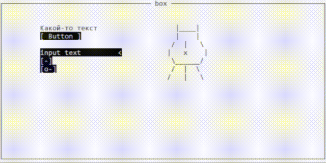
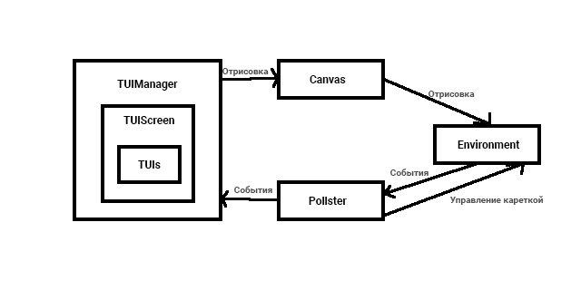

# DSRT - Dead Simple Rendered TUI for D lang
***
DSRT - мини-фреймворк для создания быстрого Terminal UI для простых приложений.  
Не пытается реализовать GUI в терминале. Имеет самое необходимое и достаточное.  
Не использует ни каких зависимостей кроме std.  

Здесь нет сложной системы вложености и позиционирования. DSRT просто рисует  
в целевую среду по заданным координатам по принципу первым добавлен - первым  
отрисован.
  
Здесь нет сложной системы фокуса, всё завязано на положении каретки - с каким  
элементом каретка совпала по координатам, тот и в фокусе. Кареткой можно управлять  
мышью (каретка перемещается в координаты мыши по нажатию ЛКМ) или при помощи стрелок.

Вместо окон есть система экранов (пространств) и менеждер для работы с ними.
***
*Буду честен DSRT - это по сути мой "Hello, world" на языке D. Как человек перешедший с C# в D*  
*я писал в стиле C#, так как мултипарадигменый D такое позволяет.*
***


Реализованные UI Элементы:
* TUIOrigin - абстрактный класс, наследником которого являются все элементы;
* TUIGhost - "призрак", не отрисовываемый элемент, имеется в каждом TUIScreen, нужен для избежания возврата Null;
* TUIBox - просто рамка, не является контейнером.
* TUIButton;
* TUICheck;
* TUIImage - принимает массив dchar[][], так же можно загрузить из файла, нужен для отрисовки ASCII-артов;
* TUIInput - поле ввода текста;
* TUILabel;
* TUISwitcher;

***
## Getting started

```

import std.format;
import dsrt.pkg;

void main() {
    IEnvironment env = new WindowsCmdEnviroment(); // Целевая среда
    Canvas canvas = new Canvas(env, Point(80, 20)); // Задаём размер окна в символах
    Pollster pollster = new Pollster(env);
    
    TUIManager ui = new TUIManager(canvas, pollster);
        
    ITUIScreen hello = new TUIScreen();
    ui.addScreen("hello", hello);    

    ITUI box = new TUIBox(Point(80, 20)); // создаём элемент и задаём размер box, position = Point(0, 0)
    box.setText = "Hello box";
    // или box.setText("Hello box");
    hello.addElement("box",box);
    
    ITUI lbl = new TUILabel(Point(32, 1)); // создаём элемент и задаём положение
    lbl.setText = "Привет, это DSRT";
    hello.addElement("lbl", lbl);
    

    ITUI btn = new TUIButton(Point(35, 2)); // создаём элемент и задаём положение
    hello.addElement("btn", btn);

    ui["hello"]["btn"].onEnterReleasedAction = (e) // Enter или ЛКМ
    {
        ui["hello"]["lbl"].setText = "Кнопка была нажата!!!";
    };

    ui.setActive("hello"); // делаем экран активным    
    ui.draw(); // Отрисовываем экран
    
	while (true) // Цикл для прослушки событий от среды
    {
        ui.update();
    }    
}

```
Если забыть вызвать  ui.setActive("[screen name]") - ошибки не произойдёт, будет вызван экран   
"404(экран не найден)",
где будет кнопка, делающая активным самый первый добавленный экран.  
Если в TUIManager не добавлен ни один экран (ui.addScreen("[screen name]", [var name])), то кнопка  
вернет снова экран "404(экран не найден)".

Обращаясь к TUIScreen или элементам по имени (ui["hello"]["btn"]) не стоит боятся ошибки Null, так как ошибки  
не будет, при использовании неверного несуществующего имени будет возвращёт элемент "призрак", это событие
будет отмеченно в списке ошибок, а программа продолжит работать. Узнать список полученных ошибок можно  
обратившись к проперти TUIScreen - getElementsErrorLog, или вызвав метод saveElementsErrorLog(),  
который сохранит список ошибок в файл logs.txt в корневой директории приложения.

TUIScreen можно сохранить в JSON - DsrtIO.saveScreen([screen name], "path"), для последущей загрузки интерфейса  
из файла, так же подобный JSON можно создать в ручную. Загрузка экрана из файла позволит редактировать UI, не  
перекомпилируя приложение, так как в приложении останется только логика элементов экрана.  

```

import std.format;
import dsrt.pkg;

void main() {
    IEnvironment env = new WindowsCmdEnviroment();
    Canvas canvas = new Canvas(env, Point(80, 20)); 
    Pollster pollster = new Pollster(env);
    TUIManager ui = new TUIManager(canvas, pollster);
    
    ui.addScreen("hello", DsrtIO.loadScreen("hello.json")); // Загрузка экрана из файла

    ui["hello"]["btn"].onEnterReleasedAction = (e)
    {
        ui["hello"]["lbl"].setText = "Кнопка была нажата!!!";
    };

    ui.setActive("hello"); 
    ui.draw(); 
    
	while (true)
    {
        ui.update();
    }    
}
```
При загрузке экрана в экран будут записанны ошибки загрузки, список которых можно получить вызвав  
getElementsErrorLog или saveElementsErrorLog().  
Так выглядит JSON с описанием элементов экрана:
```
[
{
    "name": "box",
    "type": "box",
    "position": {"x":0,"y":0},
    "size": {"x":80,"y":20},
    "style": {"activeBgColor":"white","activeTextColor":"black","inactiveBgColor":"Gray","inactiveTextColor":"black","pressedBgColor":"Gray","pressedTextColor":"black"},
    "text": "Hello box",
    "isEnable": true,
    "isActive": true
},
{
    "name": "lbl",
    "type": "label",
    "position": {"x":32,"y":1},
    "size": {"x":16,"y":1},
    "style": {"activeBgColor":"white","activeTextColor":"black","inactiveBgColor":"white","inactiveTextColor":"darkGray","pressedBgColor":"white","pressedTextColor":"darkGray"},
    "text": "Привет, это DSRT",
    "isEnable": true,
    "isActive": true
},
{
    "name": "btn",
    "type": "button",
    "position": {"x":35,"y":2},
    "size": {"x":10,"y":1},
    "style": {"activeBgColor":"black","activeTextColor":"white","inactiveBgColor":"Gray","inactiveTextColor":"darkGray","pressedBgColor":"darkCyan","pressedTextColor":"white"},
    "text": "Button",
    "isEnable": true,
    "isActive": true
}
]
```
Параметры name и type являются обязательными, если их не будет, то объект не будет создан, если же будет  
использован не валидный тип ui, то элемент так же не будет создан. Если не задать position, то элемент  
будет создан в координатах Point(0, 0), то есть в верхнем левом углу. Параметр size и вовсе не нужен  
для некоторых элементов, поскольку там он создаётся автоматически. Если не задать параметр style, то будет  
применён стиль по умолчанию к элементу.Если будет не задан text, то text элемента будет равен name.  
Если не задать isEnable и isActive, то эти параметры по умолчанию буду true.  

События элементов:
```

// Клавиши делятся на типа: arrows, serviese, unicode и none
// arrows - стрелки для управления кареткой, serviese - служебные, unicod - буквы, символы,
// none - прочее, например используется для ЛКМ.
// отсюда и разделение видов событий:

onEnterPressedAction // Клавиша Enter или лкм опущены
onEnterReleasedAction // Клавиша Enter или лкм были подняты после опускания
onBackPressedAction // Клавиша Backspace опущена
onBackReleasedAction // Клавиша  Backspace была подняты после опускания
onAnyServiesKeyPressedAction // Аналогично для прочих служебных клавиш
onAnyServiesKeyReleasedAction // Аналогично для прочих служебных клавиш
onTypingAction // Нажатие юникод клавиш

```
***
## Pipeline

***
## DSRT Reference
### Интерфейсы:
#### ICanvas
Название  | Описание
------------- | -------------
@property int getWidth()  | Получить ширину среды / холста
@property int getHeight()  | Получить высоту среды / холста
public void draw(ITUI content) | Отрисовать UI элемент
public void clear()  | Очистить холст
#### IEnvironment
Название  | Описание
------------- | -------------
public void drawMatrix(int x, int y, dchar[][] matrix, ushort textColor, ushort bgColor) | Отрисовывать в энвайромент (UI element)
public void setWindowSize(Point size)  | -
public Point getWindowSize() | -
public void lockSize()  | Заблокировать изменение размера окна
public void setCursorPosition(Point position) | -
public Point getCursorPosition() | -
public void makeCyrilic()  | Задать вывод кирилицы
public EnvironmentEvent pollEvent() | Получить события среды
public void disableQuickEdit() | Отключить режим быстрого редактирования среды
#### IPollster
alias ClickHandler = void delegate(EnvironmentEvent e)
Название  | Описание
------------- | -------------
@property public void onClickAction(ClickHandler handler)  | Событие среды
public void update()  | -
#### ITUIManager
Название  | Описание
------------- | -------------
update()  | -
public void draw()  | Перебор и отрисовка всех элементов активного экрана
public ITUIScreen opIndex(string name) | Для доступа через индекс, через ["name"]
public void addScreen(string name, ITUIScreen screen)  | -
public void setActive(string name)  | Задать активный экран, тот который сейчас отображается
public ITUIScreen getScreen(string name) | Получить экран по имени
public ITUIScreen getScreenByNumber(int n) | Получить экран по номеру присвоеному в порядке добавления
public int getScreenCount()  | Получить кол-во экранов
public string getScreenName(ITUIScreen screen)  | Получить имя экрана по объекту
#### ITUIScreen
Название  | Описание
------------- | -------------
@property public string[] getElementsErrorLog() | Получить список ошибок экрана
public ITUIScreen opIndex(string name) | Для доступа через индекс, через ["name"]
public void addElement(string name, ITUI element) | -
public void addError(string msg)  | -
public ITUI getElement(string name) | Получить элемент по имени
public ITUI getElementByNumber(int n) | Получить элемент по номеру присвоеному в порядке добавления
public int getElementCount()  | Получить кол-во элементов
public string getElementName(ITUI element)  | Получить имя элемента по объекту
public void saveElementsErrorLog()  | Сохранить список ошибок экрана в файл
#### ITUI
alias TUIEventHandler = void delegate(EnvironmentEvent e)
Название  | Описание
------------- | -------------
@property public void onEnterPressedAction(TUIEventHandler handler) | -
@property public void onEnterReleasedAction(TUIEventHandler handler) | -
@property public void onBackPressedAction(TUIEventHandler handler) | -
@property public void onBackReleasedAction(TUIEventHandler handler) | -
@property public void onAnyServiesKeyPressedAction(TUIEventHandler handler)| -
@property public void onAnyServiesKeyReleasedAction(TUIEventHandler handler) | -
@property public void onTypingAction(TUIEventHandler handler) | -
@property public TUIType getType() | -
@property public Point getSize()  | -
@property public Point getPosition()  | -
@property public dchar[][] getData()  | -
@property public string getText()  | -
@property public ushort getTextColor()  | -
@property public ushort getBgColor()  | -
@property public Style getStyle()  | -
@property public bool isPressed()  | "нажат" ли сейчас элемент 
@property public bool canPressed()  | -
@property public bool isActive()  | -
@property public bool isEnable()  | -
@property public void setPosition(Point position)  | -
@property public void setText(string text)  | -
@property public void setStyle(Style style)  | -
@property public void setActive(bool status)  | -
@property public void setEnable(bool status)  | -
@property public void setPressed(bool status)  | -
public void onPressed(EnvironmentEvent e)  | -
public void onReleased(EnvironmentEvent e)  | -
public bool intersect(Point target)  | Полверить пересекается ли элемент с точкой (кареткой например)
public void generateData()  | Сгенерировать амссив dchar[][] являющийся отображением элемента в среде
### Энумы:
#### TUIType 
Имя  | Номер
------------- | -------------
ghost | 0
box | 1
.. оставим номер про запас | -
label | 10
.. оставим номер про запас | -
input | 15
.. оставим номер про запас | -
button | 20
check | 21
switcher | 22
image | 30
#### EnvironmentEventType 
Имя  | Номер
------------- | -------------
none | 0
mouse | 1
keyboard | 2
#### KeyType 
Имя  | Номер
------------- | -------------
none | 0
service | 1
arrows | 2
unicode | 3
#### Color 
Имя  | Номер
------------- | -------------
black| 0
darkBlue| 1
darkGreen| 2
darkCyan| 3
darkRed| 4
darkMagenta| 5
darkYellow| 6
Gray| 7
darkGray| 8
blue| 9
green| 10
cyan| 11
red| 12
magenta| 13
yellow| 14
white| 15
#### Keys : ushort
Имя  | Номер
------------- | -------------
none | 0
// Стрелки |
left  | 37
up| 38 |
right | 39
down  | 40
// Навигация |
home | 36 |
end  | 35 |
pageUp   | 33
pageDown | 34
insert | 45
del| 46
// Управляющие |
backspace | 8
tab   | 9
enter | 13
escape| 27
// Модификаторы |
shift | 16
ctrl  | 17
alt   | 18
leftShift  | 160
rightShift | 161
leftCtrl   | 162
rightCtrl  | 163
leftAlt| 164
rightAlt   | 165
// Функциональные |
f1  | 112
f2  | 113
f3  | 114
f4  | 115
f5  | 116
f6  | 117
f7  | 118
f8  | 119
f9  | 120
f10 | 121
f11 | 122
f12 | 123
// NumPad |
num0 | 96
num1 | 97
num2 | 98
num3 | 99
num4 | 100
num5 | 101
num6 | 102
num7 | 103
num8 | 104
num9 | 105
numMultiply | 106
numPlus | 107
numMinus| 109
numDot  | 110
numDivide   | 111
### Структуры:
#### EnvironmentEvent 
Название  | Описание
------------- | -------------
EnvironmentEventType type | Тип события
int x | Позиция X (мышь или каретка)
int y | Позиция Y (мышь или каретка)
bool isPressed | Состояние кнопки (нажата/отпущена)
KeyType keyType | Если клавиша "скрвисная" не имеет юникода, а является конвертацией хекс кода то она мышь или сервис или стрелки
dchar key | Символ нажатой клавиши
uint timestamp | 
#### Point 
Название  | Описание
------------- | -------------
int x | -
int y | -
#### Style 
Название  | Описание
------------- | -------------
ushort  activeTextColor | -
ushort  activeBgColor| -
ushort  inactiveTextColor | -
ushort  inactiveBgColor| -
ushort  pressedTextColor | -
ushort  pressedBgColor| -
### Классы:
class Canvas : ICanvas  
class Pollster : IPollster  
class WindowsCmdEnviroment : IEnvironment  
class TxtEnvironment : IEnvironment  
class TUIManager : ITUIManager  
class TUIScreen : ITUIScreen  
abstract class TUIOrigin : ITUI   
class TUIGhost : TUIOrigin  
class TUIBox : TUIOrigin  
class TUIButton : TUIOrigin  
class TUICheck : TUIOrigin  
class TUIImage : TUIOrigin для создания можно использовать public static TUIImage loadFromFile(string path)  
class TUIInput : TUIOrigin  
class TUILabel : TUIOrigin  
class TUISwitcher : TUIOrigin  

##### DsrtIO
Название  | Описание
------------- | -------------
JSONValue toJson(Point p) | Конвертировать Point в JSON
JSONValue toJson(Style s)|  Конвертировать Style в JSON

##### class DsrtIO
Название  | Описание
------------- | -------------    
public static void saveScreen(ITUIScreen screen, string path)| Сохранить экран в файл
public static ITUIScreen loadScreen(string path) | Загрузить экран из файла 
protected static ITUI makeTUI(TUIType type, Point position, Point size, Style style, string text, bool enable, bool active)| фабрика для UI